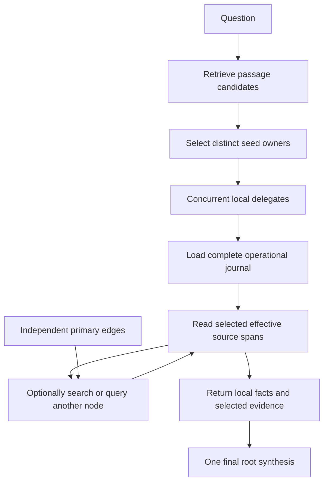

# LLGM research architecture

Current architecture, reviewed September 11, 2026. LLGM combines immutable
full-text evidence, independent primary edges, small local journals and recursive
model access. The library implements this structure. Whether it produces better
answers at a useful cost remains the research question.

The [roadmap](../ROADMAP.md) owns priorities and the current LongMemEval scope.
The [public architecture](../../docs/guide/architecture.md) owns implementation
contracts. [Research directions](directions.md) records alternatives, and the
[objective map](experiments.md) retains broader comparisons without authorizing
execution. The [September 9 specification](technical-spec.md) is historical.

## Design and vocabulary

| Term | Current meaning |
| --- | --- |
| Persistent Evidence Graph (PEG) | Immutable source nodes, independent directed primary edges, and per-node interpretation journals |
| Evidence node | One immutable source occurrence with exact text, turn order, speaker roles and optional source time |
| Primary edge | A separately stored discovery relationship with provenance, applicability and withdrawal |
| Node journal | Append-only local annotations and interpretation changes, including references to other evidence |
| Evidence reference | A node handle, stable Unicode coordinates in an immutable source, or an address into a journal entry |
| Search passage | A derived retrieval unit mapped to canonical references, not another authoritative source |
| Node delegate | A model invocation sequence that investigates a node and returns supported findings, typically assigned a smaller model |
| Root reasoner | The final model that combines admitted branch findings into the answer |
| Execution trace | Records of actual admission, operations, children, evidence and outcomes |

Primary connectivity does not derive solely from journals. Ordinary maintenance
publishes primary edges independently. Journals may point to other nodes for
corrections, but do not replace that edge store. Original source text remains
addressable after an amendment. There is no source-version dimension, mandatory
workspace snapshot or public commit/read-basis API.

The graphical-model connection is local computation and bounded messages between
node investigations. Sources are not defined random variables, and the runtime
does not implement probabilistic factorization or belief propagation. There are
no standalone query factors or executable edges. Runtime parent and invocation
IDs describe actual calls, without requiring a persistent factor graph.

## Current answer flow

Initial selection is deterministic. The application retrieves twelve passages by
default and admits their first three distinct node owners. Every distinct
matched reference from the returned pool remains available to its selected
owner. These are handles, not automatically loaded text. The experimental
small-model selector and BM25/ColBERT fusion have not replaced the product rule.
The [node-search guide](../../docs/guide/node-search.md) explains exact behavior.

Each delegate runs generated Python in an isolated Docker interpreter. It can
inspect turn metadata, read effective spans, inspect primary relationships,
search globally or call a recursive child. Children return selected findings
through their parent chain. They do not share complete conversations or Python
variables. Locality controls computation, not source authorization.

Every seed and child receives a bounded first page of turn roles and span
coordinates. Reading takes one reference per call. The delegate must print the
result, or selected records from it, before the model can inspect the text.

The final root receives exact selected canonical evidence before attributed
branch findings, which are treated as fallible summaries. It has one synthesis
call and no subsequent search phase. Root-driven requery or
escalation remains a possible experiment, not current behavior. Node delegates
are a model role, not personas or permanent processes attached to graph nodes.

## Sources, journals and evidence delivery

Ingestion preserves exact source text. New observations get new nodes. Stable
references retain role, date and provenance through search, reads and answers.
An assistant suggestion and a user decision must remain distinguishable.
Mentioning a fact does not establish that it is current or applicable.

The complete operational journal is loaded eagerly as bounded local metadata.
Explicit replacements guide lazy source reads. Their target references may
resolve directly to other source spans. Further recursive investigation is
optional. Effective reads preserve original and replacement attribution and
report ambiguous scope, missing targets, cycles or conflicting patches.

Deterministic compaction removes redundant operational entries while preserving
raw history and canonical references. It does not bound total historical storage.
Automatic journal amendment generation, a general forgetting policy and physical
history deletion are not implemented. Ingestion-time semantic reconciliation is
not an adopted requirement.

An evidence ID is available only after its callback result fits delivery limits.
A parent can use evidence selected by a child. The root can cite only selected
branch evidence, enforced by native output constraints and host validation.
Correct addresses do not prove correct interpretation. The model can still read
the wrong turn, omit a relevant fact, confuse event dates or cite an irrelevant
quote.

Current delegate instructions ask for bounded inspection of relevant ranked
references and local facts with subjects, values, dates and supporting evidence.
The root is instructed to verify quoted support before comparing dates or
counting items. These reading and evidence-presentation changes were exercised
in the later frozen development runs. V6 answered all five exposed questions
correctly with a GPT-5.4 medium-reasoning root and GPT-4.1 delegates and
maintenance. Earlier controls used GPT-4.1 readers, so the result does not
isolate the architecture's contribution or establish independent generalization.

## What the completed experiments establish

| Evidence | Established within the run's scope | Still unresolved |
| --- | --- | --- |
| [ColBERT integration](../reports/colbert-modal-2026-09-11.md) | Actual official checkpoint, PLAID build/search, persisted reopen and local client retrieval | Large-scale and production serving performance |
| [Node search](../reports/node-search-2026-09-11.md) | Candidate-source coverage and loss during bounded seed admission | Whether admitted sources yield useful facts and answers |
| [Node selection](../reports/node-selection-2026-09-11.md) | Controlled gains from a hosted selector, benchmark coverage regressions, and complementary evidence lost by fused top-40 truncation | A better general selection rule or useful default fusion |
| [Frozen-seed answers](../reports/seed-answers-2026-09-11.md) | Real inference and evidence-delivery failures under the recorded model/budget settings | A dependable selector winner |
| [LongMemEval development runs](../reports/longmemeval-2026-09-11.md) | V1 admitted all annotated nodes for each LLGM miss. Later reading, synthesis and model changes reached 5/5 in v6 | Generalization beyond the exposed questions and an advantage under matched model allocations |

Later root citation, maintenance-schema and Docker cleanup repairs do not rewrite
earlier failure records. A controlled removal race was reproduced and repaired.
The historical failures' exact cause remains unknown where stderr was not retained.
The original v1 pilot had no failed physical API calls and no failed admitted
delegates despite its answer errors.

The v1 pilot generated eighty primary edges but made no recursive child calls
and applied no journal amendments. V6 likewise made no recursive child calls,
inspected no edges and applied no journal amendments. These runs do not
demonstrate a graph-traversal benefit.
Earlier curated diagnostics established actual recursive operation, which is a
different claim from useful automatic navigation on benchmark histories.

## Research priority and claims

The immediate priority is preserving useful facts from passage candidates to
the answer. Separate candidate retrieval, owner selection, span inspection,
branch return, synthesis and claim attribution. Fix the earliest observed loss.
The [node-search improvement order](../ROADMAP.md#node-search-improvement-order)
specifies the next comparisons and their measurements.

Keep BM25 and ColBERT available. Do not infer that fusion helps merely because it
uses both, or that selectors are equivalent because both fail downstream.
Measure final correctness alongside source coverage, evidence support, actual
backend work, generation and preparation cost. Unknown usage stays unknown.

LongMemEval-S is the active benchmark. The five-question development gate is
complete, and the stopped full run remains stopped. The cases are exposed and
share histories. They do not constitute independent held-out evidence. A
paper-level quality or cost claim needs a frozen comparison and explicit
treatment of that exposure.

LLGM remains a working name for graph-structured evidence memory with recursive
LLM inference. The final paper's contribution should follow measured results,
whether they come from search, evidence messages, graph navigation or journals.
Long-session continuity and general ensemble inference remain ambitions, not
established consequences of this architecture.
