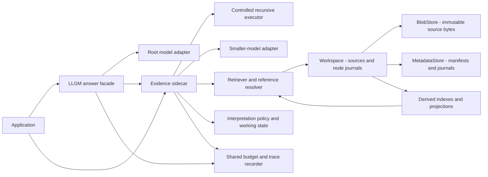

# Historical technical baseline: September 9, 2026

**Status: superseded historical proposal.** This document records the original
Python-library target, illustrative interfaces and delivery plan. Its future-tense
requirements describe that September 9 proposal. They are not current API
contracts, implementation instructions or additional contributor requirements.

The [current research architecture](overview.md) and
[September 10 simplification decision](simplification.md) supersede this
document's source editions, public commit/read-basis model and mandatory
workspace snapshots. Its API sketches, configuration examples, module layout,
milestones and release requirements remain historical. Current support belongs
in the [architecture guide](../../docs/guide/architecture.md),
[implementation status](../../docs/reference/implementation-status.md) and
[quickstart](../../docs/guide/quickstart.md). Contributor instructions belong in
the [development documentation](../../development/README.md).

The intended deliverable is a reusable, typed Python library distributed through **PyPI**, with installation instructions, tutorials, API documentation, examples, and reproducible research tooling. The library should support both evidence gathering for an existing application and an optional root-reasoner workflow that produces an answer.

The proposal below is retained to explain earlier implementations and dated
measurements. The [experiment design](experiments.md) owns the active objective
map, while [research directions](directions.md) owns current open choices.
Original experimental results remain in [research reports](../reports/README.md).

## 1. Product scope and completion criteria

LLGM consists of a frontier **root reasoner**, a smaller-model **evidence sidecar**, and a **Persistent Evidence Graph (PEG)**. Each evidence node preserves full source text and owns one journal containing typed relationships and interpretation edits. Stable references are shared by search, journal entries, requests, and returned evidence.

The public library must let an application:

1. Ingest exact conversational evidence and reopen it after a process restart.
2. Resolve stable source references independently of search chunking.
3. Append, inspect, and correct node-journal records without overwriting source history.
4. Search passages, inspect journals, and gather bounded evidence through a configurable sidecar.
5. Optionally delegate a complete question to a root reasoner backed by that sidecar.
6. Inspect versions, provenance, stop reasons, and resource usage.
7. Replace retrieval, model, and interpretation components without forking the core library.
8. Run every generative model role through hosted APIs, with no required local model weights or GPU.
9. Select model providers, source storage, metadata databases, and retrieval backends through typed environment configuration or explicit Python injection.

The final documented package must install from a wheel in a clean environment, execute an offline quickstart, document native OpenAI and Anthropic integrations plus an OpenAI-compatible adapter, and provide tested persistence and migration behavior. Local filesystem/S3 source storage and SQLite/Postgres metadata adapters are explicit delivery targets, with a published compatibility matrix. These are requirements, not existing capabilities. Research claims require separate experimental evidence. Publishing a package does not establish benchmark superiority.

The first implementation uses text evidence and local storage to establish correctness and baseline measurements. Its interfaces must accommodate the remote backends above without changing evidence identity or application semantics. A managed LLGM service, arbitrary distributed transactions, autonomous personas, multimodal ingestion, and a general probabilistic factor graph are outside this delivery scope. Standalone query nodes and a required runtime graph are absent. An execution trace can record dependencies.

## 2. Initial engineering decisions and open policies

| Area | Proposed first implementation | Reason / boundary |
| --- | --- | --- |
| Language | Python 3.11 minimum. Initially test CPython 3.11–3.14 | Typed asynchronous APIs and a defined compatibility matrix. Support is claimed only after CI passes |
| Import package | `llgm` | Provisional import namespace |
| PyPI distribution name | Provisionally `llgm`, pending availability and ownership verification | A failed lookup or empty search does not establish availability. Publication is a later release step |
| Core types | Frozen dataclasses, enums, typed protocols, versioned JSON serialization | Small dependency surface and explicit contracts |
| Source bytes | Immutable blobs on local filesystem first. S3 adapter planned | Physical location is separate from stable evidence identity |
| Transactional metadata | SQLite through the standard-library adapter first. Postgres adapter planned | Owns source manifests, node journals, publication, and visibility |
| Initial retrieval | SQLite FTS5 lexical search, with capability detection and an explicit portable lexical alternative | A baseline that runs without model weights. Do not silently substitute backends in experiments |
| Model integration | Provider-neutral `ModelClient`. Native OpenAI/Anthropic, OpenAI-compatible, callable, and deterministic test adapters | All generative roles can use hosted inference. Provider capabilities remain explicit |
| Configuration | Typed settings resolved once from explicit fields, a selected config file, environment, and defaults | Environment selection and Python dependency injection share one validated configuration |
| Semantic interpretation | Named, versioned policy selected by configuration | Recording an assertion never automatically establishes its truth or applicability |
| Reconciliation timing | Configurable and externally schedulable | Ingestion, query-time, background, and hybrid strategies remain experimental options |
| Documentation | Sphinx with MyST Markdown, API extraction, and executable examples | User guides and reference documentation alongside research notes |
| Build | `pyproject.toml`, `src` layout, Hatchling, wheel and source distribution | Standard Python packaging workflow |

The base package should avoid heavy runtime dependencies. Provider SDKs, S3/Postgres drivers, structured-output helpers, dense retrieval, ColBERT/PLAID integration, isolated execution backends, and benchmark adapters belong in optional extras or development groups. Exact integration dependency bounds must be established by compatibility tests before release.

The repository's existing [MIT license](../../LICENSE), including its copyright notice, is retained. Neither a PyPI project name nor a documentation hosting URL is currently claimed.

## 3. Architecture and responsibilities



The `Workspace` owns authoritative sources and journals. An `EvidenceSidecar` owns a delegated evidence request, including routine follow-up search and local composition. The optional `LLGM` facade coordinates a root reasoner with the sidecar. A root should not need to choose every passage read.

Internally, an `EvidenceStore` coordinates immutable bytes in a `BlobStore` with transactional records in a `MetadataStore`. Retrieval indexes are separate derived components. A single public workspace hides this coordination while exposing each backend's capabilities and operational limits. Source data has one authoritative published representation. Any index copy is rebuildable.

Storage, resolution, index mechanics, scheduling, and accounting are deterministic code. Model calls interpret language and formulate or answer information needs. Maintenance may use the same smaller model as inference, but its costs and effects remain separately attributable.

Root reasoning, sidecar planning/reading, recursive subcalls, query rewriting, semantic linking, journal interpretation, and optional model-based evaluation can all call hosted models. Models can be selected independently by role. The evidence sidecar is a logical subsystem, not a requirement for a separate process. LLGM orchestration, storage access, and controlled execution run in the application's configured runtime or workers. Hosting model inference does not host those operations automatically.

Runtime source handles, intermediate results, and optional dependency traces do not become PEG nodes. The sidecar may make several recursive calls without creating persistent computation identities.

## 4. Authoritative data model

### 4.1 Sources and stable references

A `SourceNode` contains a stable node ID and published source versions. A version preserves ordered turns with turn IDs, roles, exact text, and source provenance. Initially, ingestion publishes a sealed version. Subsequent material creates another node or explicit immutable version rather than editing referenced text in place.

The proposed reference types are:

```text
SourceSpan
    node_id
    source_version
    turn_id
    start       inclusive Python Unicode-code-point offset
    end         exclusive Python Unicode-code-point offset

JournalRef
    node_id
    entry_id
    optional start/end within that entry's inline value text

NodeRef
    node_id
    optional explicit source version for whole-source reads
```

Offsets refer to the exact stored turn text, not a model prompt with inserted role labels, token positions, or normalized search text. Validate bounds, versions, and target kinds. Preserve Unicode without normalization of canonical text. Index normalization is a separate derived operation. Whole-entry `JournalRef` values address structural records, while ranged references address only the defined inline-text field.

`EvidenceRef` is the tagged union of these types. An unversioned `NodeRef` is a navigation selector resolved under a declared read basis. It must be frozen to a specific source version or span before entering a committed journal record or becoming a durable citation. Append validation rejects an unresolved versionless reference. A finding can carry several references. A mutable search chunk ID is never a canonical evidence ID. Source versions and journal versions are independent.

Repeated identical text from different sources retains distinct evidence identity. Physical blob deduplication, if later added, must not merge provenance or imply independent corroboration. Ingest retries use an explicit idempotency key. Reuse with different content returns a conflict.

### 4.2 One node journal

Each node has one logical journal, even if the database uses a header table and an entries table. No second mutable semantic edge store is authoritative.

```text
JournalEntry
    schema_version
    entry_id
    owning_node_id
    journal_sequence
    commit_id
    recorded_at
    subject: EvidenceRef
    record_kind
    relation or correction_operation
    value: InlineText | EvidenceRef
    provenance
    optional applicability
```

A relation assertion can express `related_to`, `supported_by`, `clarified_by`, `contradicted_by`, or `superseded_by`. These initial strings form an extensible vocabulary, not universal reasoning rules. A journal correction targets an earlier journal entry. It differs from a source statement being replaced by another source statement.

Provenance records origin, producer identity, supporting references, and relevant model/prompt/policy version for model-derived records. Applicability may represent entity, scope, modality, and the time described by the statement. Unknown information remains unknown. It is not inferred from insertion order.

Append validation checks structure, reference integrity, ownership, and version preconditions. It does not establish semantic truth. A correction appends another record rather than mutating the original. Competing or ambiguous interpretations remain inspectable under the chosen policy.

A referenced node need not already be a neighbor. The record establishes the relation. Reverse adjacency, current-link views, and interpretation annotations are derived from the journal and tagged with their originating entry IDs and versions.

### 4.3 Search and runtime records

| Record | Required information |
| --- | --- |
| `SearchPassage` | Index generation, chunk ID, one or more stable source ranges, parent nodes, derivation metadata |
| `SearchHit` | Passage references, backend score, rank, originating request, index/read basis |
| `ReadBasis` | Source/journal visibility cutoff, index generations, interpretation policy, freshness information |
| `EvidenceRequest` | Original task constraints, delegated need, optional seed references, scope, budget, read basis |
| `EvidenceFinding` | Claim or excerpt, source refs, qualifications, derivation, relevant journal refs |
| `EvidenceBundle` | Bounded findings, external material handles, unresolved needs, stop reason, usage, read basis |
| `AnswerResult` | Answer, supporting references, evidence bundle handle, usage, trace ID, completion/limitation status |

External runtime handles are explicitly different from durable evidence references. An ephemeral model-generated finding must not masquerade as a committed journal entry or original source.

## 5. Persistence and visibility

### 5.1 Bytes, metadata, and publication

| Component | Authoritative responsibility | Planned adapters |
| --- | --- | --- |
| `BlobStore` | Immutable serialized source versions, including exact turn text. Optionally large immutable artifacts | Local filesystem. S3 |
| `MetadataStore` | Nodes, source/turn manifests and checksums, journal headers/entries, commits, idempotency, schema metadata | SQLite. Postgres |
| Retrieval/index backend | Derived searchable text, embeddings, reference mappings, and generation watermarks | SQLite FTS5 first. Remote lexical/dense/late-interaction adapters as declared |

Small journal inline-text values stay in the transactional journal rows. This is still one logical node journal. A source manifest maps a logical version to its immutable blob and codec. Stable references never contain a bucket name or physical object key. Moving bytes must preserve resolved text and checksums. Search mappings, reverse relations, checkpoints, caches, and run records are derived or operational records. All SQL parameters are bound. Model text is data.

Publish source bytes before their metadata reference: write an immutable object, verify completion and checksum, then transactionally commit the source manifest and any associated journal records. Only committed manifests are visible. This does not assume an atomic transaction spanning S3 and a database. Idempotent retry must distinguish an already committed ingestion from an abandoned upload. Failed publication can leave orphan objects. Cleanup needs a grace period, active-upload protection, and an authoritative reference check. Derived indexes advertise their own completed watermark.

S3 is an object-storage target, not a location for a live SQLite database file. SQLite remains on supported local storage in a mixed S3/SQLite profile. That profile does not acquire distributed multiwriter capabilities. S3/Postgres supports a separate concurrency profile that must pass the same evidence and journal contracts. [Amazon S3 overview](https://docs.aws.amazon.com/AmazonS3/latest/userguide/Welcome.html)

### 5.2 Visibility and backend guarantees

A source/journal transaction receives a monotonically increasing local commit ID. Journal appends also check an expected journal sequence and support an idempotency key. A conflict returns enough information for the caller to reread and retry. It must not rerun a costly model interpretation invisibly or append duplicate semantic changes.

The local commit ordering above is specific to the serialized SQLite writer. A Postgres adapter must implement a documented snapshot/visibility token and atomic journal-sequence checks. An allocated sequence number alone is not proof of transaction commit order. `ReadBasis` carries the backend's declared visibility semantics. A remote index needs a compatible generation or reconstruction protocol. Unsupported combinations fail validation. Exchanging a driver must not silently weaken the requested read guarantees. [PostgreSQL transaction isolation](https://www.postgresql.org/docs/current/transaction-iso.html)

A run captures a visibility cutoff. Reads resolve immutable sources and journal records visible under that cutoff. The implementation must not hold a database write transaction open across a model call. Blocking SQLite work should use a controlled worker/connection strategy compatible with asynchronous callers, rather than blocking the event loop or sharing a connection unsafely. See the [Python sqlite3 API](https://docs.python.org/3/library/sqlite3.html).

Query-time interpretation can operate in a run-local overlay over the captured evidence. That overlay contains derived findings or draft journal entries, clearly distinguished from committed records. Publishing drafts is a separate explicit operation with version checks. The default answer path does not publish shared semantic mutations. Experiment policies can orchestrate publication before or after a query and account for it. A run must not silently gain unrelated future evidence because another process commits during inference.

Derived index generations record source/journal watermarks. The first synchronous lexical index can update with local commits. Other backends must declare whether they can serve a captured cutoff, use a versioned generation, or combine an older index with a pending tail. Visibility filtering must be part of retrieval before final top-k selection. Filtering a few latest hits afterward is not an adequate historical retrieval contract.

The first FTS backend pins a dedicated SQLite read snapshot for source manifests, journals, and index reads during a run. Source text resolves through those manifests to immutable blobs. This freezes corpus statistics as well as visible rows. Filtering future documents in a mutable index alone would not reproduce earlier ranking. Use WAL mode on supported local storage, keep the reader separate from writers, and release it on completion or cancellation. Long readers can delay checkpoints, so their storage and latency effects belong in E08. This database WAL is an implementation mechanism distinct from a node's semantic journal. [SQLite isolation](https://www.sqlite.org/isolation.html), [WAL behavior](https://www.sqlite.org/wal.html)

A closed SQLite transaction cannot later be reopened merely by its LLGM commit ID. Historical retrieval therefore loads a retained index snapshot or rebuilds an index from the permitted source prefix with the pinned backend/tokenization configuration. Record and account for that preparation. Reject unsupported historical-index requests rather than silently using present-day ranking state.

Reopening a workspace validates schema compatibility. Migrations are versioned, transactional where possible, and explicitly invoked for incompatible changes. Reference resolution must survive supported migrations. Never overwrite source or journal history to rebuild an index. Connection pooling, source-fetch batching, bounded concurrent I/O, and backpressure belong to backend/runtime configuration. No automatic linear scaling or Iceberg deployment follows from this abstraction.

## 6. Public Python API

The primary model-facing API is asynchronous. Synchronous inspection helpers may be provided for local tooling. Any synchronous answer wrapper must clearly reject use inside an already running event loop. Python's task and cancellation behavior informs the runtime implementation. [Python asyncio tasks](https://docs.python.org/3/library/asyncio-task.html)

Proposed high-level usage, not currently executable:

```python
from llgm import LLGM, Budget, Conversation, EvidenceSidecar, Workspace

# frontier_model and small_model implement the documented ModelClient protocol.
async def ask_about_atlas(frontier_model, small_model):
    async with Workspace.open("./memory") as memory:
        await memory.ingest(
            Conversation.from_turns([
                {"role": "user", "text": "Atlas production uses PostgreSQL."},
                {"role": "assistant", "text": "Recorded as the current decision."},
            ]),
            idempotency_key="atlas-discussion-001",
        )

        sidecar = EvidenceSidecar(
            memory=memory,
            model=small_model,
            mode="structured_recursive",
        )
        llgm = LLGM(root=frontier_model, sidecar=sidecar)
        result = await llgm.answer(
            "What database did we choose for Atlas production?",
            budget=Budget(max_model_calls=12, timeout_seconds=90),
        )
        print(result.answer)
```

Numbers above illustrate explicit limits and are not validated defaults. An offline quickstart must supply a deterministic model client so this flow can be exercised without an account. A live tutorial must show how to supply a real client and how evidence is sent to that provider.

The library also exposes evidence gathering without a root, for applications that already own answer generation:

```text
Workspace.ingest(conversation, idempotency_key) -> IngestResult
Workspace.resolve(reference, read_basis) -> ResolvedEvidence
Workspace.append(entry, expected_version, idempotency_key) -> CommitResult
Workspace.inspect_journal(node, read_basis, filters) -> journal records
Workspace.reindex(config) -> IndexGeneration

EvidenceSidecar.gather(request, budget) -> EvidenceBundle
LLGM.answer(question, budget, scope, read_basis) -> AnswerResult
```

Methods accept typed options rather than an unbounded dictionary of behavior switches. Public models have documented JSON forms. `answer` does not automatically persist the completed conversation or publish journal edits. Applications use ingestion and journal operations deliberately. Operational traces and caches have separately documented storage behavior.

### 6.1 Environment configuration and dependency injection

The proposed settings loader uses this precedence, highest first:

1. Explicit runtime arguments or injected component instances.
2. Explicitly supplied settings fields/overrides.
3. Fields in an explicitly selected configuration file.
4. `LLGM_` environment variables.
5. Documented defaults.

Only fields actually supplied override lower layers. Dataclass defaults must not accidentally erase environment values. Preserve field provenance for diagnostics. Read environment variables once when resolving settings, then keep that workspace's configuration immutable. Two workspaces in one process can use different settings without changing global environment variables. Imports and settings parsing perform no network access.

Proposed local profile:

```dotenv
LLGM_BLOB_BACKEND=local
LLGM_BLOB_URI=file:///absolute/path/memory/blobs
LLGM_METADATA_BACKEND=sqlite
LLGM_DATABASE_URL=sqlite:////absolute/path/memory/metadata.sqlite3
LLGM_RETRIEVER_BACKEND=sqlite_fts5
```

Proposed remote profile. All adapter names below are design targets, not currently executable configuration:

```dotenv
LLGM_BLOB_BACKEND=s3
LLGM_BLOB_URI=s3://example-llgm/project-a/
LLGM_METADATA_BACKEND=postgres
LLGM_DATABASE_URL=postgresql://db.example/llgm
LLGM_RETRIEVER_BACKEND=postgres_fts
LLGM_ROOT_PROVIDER=openai
LLGM_ROOT_MODEL=your-root-model-id
LLGM_SIDECAR_PROVIDER=anthropic
LLGM_SIDECAR_MODEL=your-sidecar-model-id
```

The database URL is an LLGM-parsed configuration URI, not a value passed unchanged to every underlying driver. `postgres_fts` denotes a planned Postgres lexical adapter with declared snapshot support. Its ranking is not assumed identical to SQLite FTS5. Retrieval can instead use a separately configured service. Hosted generation settings can be combined with either storage profile. The settings schema also covers provider base URLs, role overrides for maintenance/recursive calls, budgets, pool sizes, I/O concurrency, timeouts, and retrieval configuration. Recursive and maintenance roles inherit the sidecar's model unless explicitly overridden. Record their resolved identities.

Credentials use provider/driver credential mechanisms, such as SDK credential chains or named secret/environment references. Never put credential values or credential-bearing URLs in traces, examples, or resolved manifests. `LLGM_` configuration is distinct from standard provider credential variables. A provider-specific base URL and key reference belong to that adapter, not a single global model endpoint.

Proposed factory usage, not currently executable:

```python
from llgm import LLGM, Settings, Workspace

async def configured_answer(question):
    settings = Settings.from_env()
    async with LLGM.from_settings(settings) as engine:
        return await engine.answer(question)

async def configured_read(reference, read_basis):
    settings = Settings.load(config_file="llgm.toml", overrides={})
    async with Workspace.open(settings=settings) as memory:
        return await memory.resolve(reference, read_basis=read_basis)
```

`Workspace.open("./memory")` is shorthand for the documented local profile. The context-managed `LLGM.from_settings` factory creates the workspace, model adapters, sidecar, and resource ownership needed for the answer workflow. Applications can inject existing component instances instead. Injected instances take precedence and are not duplicated. Factories close resources they create, while caller-owned injected clients remain caller-owned. Applications must perform workspace operations inside its context. A handle returned after context exit is closed.

Validate names, types, unknown `LLGM_` keys, missing extras, incompatible URI/backend choices, role capabilities, and requested visibility guarantees. Fail with a focused error instead of silently substituting a local backend or a different model. Config-file and environment forms resolve to the same typed schema. Environment configuration selects an implemented adapter. It is not a promise that any arbitrary database or provider already works.

## 7. Extension protocols

| Protocol | Responsibility and minimum contract |
| --- | --- |
| `ModelClient` | Async generation, model identity/capabilities, token accounting or estimation, normalized usage, cancellation behavior |
| `EvidenceStore` | Coordinate immutable source resolution, journal append/read, publication, visibility, export and schema metadata |
| `BlobStore` | Immutable put/get/range access where supported, checksums, publication recovery, lifecycle capabilities |
| `MetadataStore` | Atomic manifests/journal transactions, idempotency, optimistic concurrency, snapshots and schema versions |
| `Retriever` | Search stable references at a declared read basis, expose index generation and freshness, report retrieval work |
| `EmbeddingClient` | Optional retrieval encoding with explicit representation/model version, dimensions, batching, and usage |
| `RerankerClient` | Optional candidate scoring with stable candidate identities, model/version, limits, and usage |
| `PassageIndexer` | Derive chunks from source ranges and publish mappings without redefining evidence identity |
| `JournalInterpreter` | Interpret records for scope/time and return findings or proposed entries with provenance |
| `ReconciliationPolicy` | Select when and what interpretation work to schedule. No hidden global background loop |
| `RecursiveExecutor` | External handles, controlled operations, nested model calls, shared budgets, cancellation, and trace hooks |
| `UsageRecorder` | Attribute events to request, role, model, maintenance stage, and price basis |

A `CallableModelClient` lets an application adapt its existing SDK. Normalized capabilities prevent assuming every provider supports the same structured output, token counting, or tool protocol. A model provider and its version are explicit configuration. Neither frontier nor small model is hard-coded.

Adapter conformance tests check return types, missing usage, exceptions, cancellation, and visibility guarantees. Optional adapters import lazily and produce a focused installation error when their extra is missing. Core imports do not contact a provider or download weights.

### 7.1 Hosted model adapters and structured output

```text
Root / sidecar / recursive / maintenance roles
    -> provider-neutral ModelClient
        -> native OpenAI adapter
        -> native Anthropic adapter
        -> OpenAI-compatible endpoint adapter (for example, vLLM)
        -> application adapter or optional model gateway

Structured-output parsing and validation
    -> provider-native support or optional Instructor integration
```

`ModelClient` requests contain normalized messages, operation/tool definitions, optional output schema, output limit, and deadline. Responses expose text/tool calls, finish/refusal/incomplete status, provider request ID, actual model identity, usage, and retained provider-specific metadata. Capabilities distinguish tool calls, schema support, streaming, caching, token estimates, and context limits. Preserve opaque provider state needed for subsequent calls within that adapter. Unsupported features require an error or an explicitly configured and recorded alternative. Never silently drop a schema or change models.

LLGM executes requested tools and recursive calls in its runtime and passes results back through the adapter. This fits hosted function-calling APIs. Schema-conforming output still requires application validation and refusal/incomplete handling. [OpenAI function calling](https://developers.openai.com/api/docs/guides/function-calling), [structured outputs](https://developers.openai.com/api/docs/guides/structured-outputs)

OpenAI compatibility is one integration path, not the core semantic contract. Anthropic's compatibility layer is intended primarily for testing/comparison and omits features including prompt caching. It ignores `response_format` and tool `strict`. Prefer its native API for the production adapter. vLLM compatibility likewise requires a supported model/server/tool-parser configuration. [Anthropic compatibility](https://platform.claude.com/docs/en/cli-sdks-libraries/libraries/openai-sdk), [vLLM server](https://docs.vllm.ai/en/latest/serving/online_serving/openai_compatible_server/)

Instructor can provide provider integrations, typed extraction, validation, and repair. Keep it optional inside an adapter. It does not replace LLGM's storage, recursive scheduling, evidence semantics, or accounting. Applications using a model gateway can inject an adapter without making that gateway a core dependency. Assign one retry owner or expose every SDK/helper/gateway attempt to the shared ledger, including schema repairs and configured fallbacks. [Instructor integrations](https://python.useinstructor.com/integrations/)

Retrieval inference is separate from generation. A hosted dense embedding API does not implement ColBERT's token-level late-interaction representation. A ColBERT profile needs a compatible encoder/index, deployed locally or as a remote service. It must not silently substitute dense vectors. Lexical retrieval plus hosted generation provides a configuration with no local model inference. Remote embedding, reranking, or retrieval adapters can preserve that property when available. No requirement says every chat-model provider must supply every retrieval representation.

## 8. Sidecar execution and RLM modes

The sidecar owns a delegated loop: search, inspect relevant sources/journals, identify a narrower need, recurse or follow a reference, compose findings, and stop. It retains large text and intermediate results in external working storage. Returning every operation to the frontier root defeats the intended cost allocation.

Modes are distinct experiment choices:

| Mode | Implementation contract |
| --- | --- |
| `iterative` | Smaller model chooses bounded search/read operations without recursive model subcalls. Baseline |
| `structured_recursive` | A validated operation interpreter supports external handles, bounded iteration, and nested smaller-model requests. First portable recursive backend |
| `isolated_repl` | Adapter to an isolated programmatic environment supporting handle-based source access and recursive model calls. Closest reference-paper execution path |

The structured interpreter accepts a bounded operation language such as read, search, inspect journal, call submodel, iterate over handles, and compose. It is not arbitrary Python evaluation. Its capabilities and limits must be reported rather than labeling it identical to a REPL-based RLM.

An isolated REPL backend must not execute model-generated Python with unrestricted access to the library host. It needs an explicitly configured execution environment with scoped source handles, controlled brokered model calls, resource limits, and a shutdown mechanism. A subprocess alone is not an isolation guarantee. The core installation does not silently require Docker or start an execution service.

The first research implementation may bring up iterative mode before recursive mode. The documented library target includes a tested recursive executor and a reproducible ordinary-RLM comparison. A release must accurately identify which backends are supported. The [RLM paper](https://arxiv.org/html/2512.24601v3) motivates external symbolic state and recursive calls. A smaller sidecar or repeated tool use alone is not an equivalent implementation or a novelty result.

Runtime state includes a request ID, parent dependency, read basis, inspected references, external handles, outstanding subrequests, and shared budget reservations. A call returning through its parent does not create a PEG relation. Detect repeated pending dependencies, preserve evidence lineage, and avoid interpreting repeated readings as independent support.

## 9. Search and journal interpretation

The first lexical backend uses a capability-checked SQLite FTS5 index with deterministic query handling and documented ranking. FTS5 provides full-text search and a BM25 ranking function. Its availability depends on the SQLite build. [SQLite FTS5](https://www.sqlite.org/fts5.html)

If FTS5 is unavailable, configuration must explicitly select a portable lexical backend or return a capability error. Experimental runs record the actual implementation. Fallback must not silently change the compared system. After the local plumbing check, dense, hybrid, and ColBERTv2/PLAID adapters are required for the first E03 retrieval matrix under the same reference and visibility contracts. ColBERT remains an optional package dependency but is a committed experimental arm. Its adoption as the library default is undecided.

Passage aggregation preserves matched ranges and limits duplicate crowding by parent node. The sidecar can expand surrounding text, inspect journal entries affecting those spans, follow typed references, or issue a global search. Initial candidates do not define a closed graph boundary.

Interpretation is a separately versioned policy. The initial no-suppression policy returns source and journal evidence with provenance, including corrections and disagreements. It does not hide source text because a model recorded `superseded_by`. More selective policies are experimental components, evaluated against expected behavior and false-replacement rates.

Journal indexes can expose relation assertions, correction trails, and inline text. A projection records the policy, source/journal versions, scope, and any relevant temporal parameters. The time a statement describes is distinct from recording time. A pointer resolves immutable evidence. Requesting another node's current view is an explicit interpretation operation.

Reconciliation may be invoked by ingestion orchestration, query execution, or a caller-controlled background task. The journal format does not require an eager reconciliation schedule.

## 10. Budgets, cancellation, and errors

Every root, sidecar, recursive call, and query-triggered maintenance operation spends from one run ledger. A child receives a reservation from the parent's remaining allowance, not a fresh copy of the full budget. Keep root and sidecar usage separately visible.

```text
For each invocation:
    instructions + request + retained state + selected evidence
        + output reserve <= adapter context limit

For the run:
    completed usage + outstanding reservations <= enforceable allowance
```

Limits include calls, input/output token allowances, inspected text, working-storage size, concurrent tasks, recursion depth, and wall time. Depth alone does not bound branching. Reserve before dispatch and reconcile with reported usage. Tokenizers, estimates, cached-token prices, and provider-reported usage must be distinguished.

Dollar limits require an explicit dated price basis and an adapter capable of a conservative bound. If the bound is unavailable, strict dollar-cap mode returns a configuration error. An estimated budget is labeled estimated. Missing usage is unknown, not zero. Cancellation may stop local work without preventing billing for an already submitted request. Record attempted calls and unresolved cost rather than promising a hard provider-side spending guarantee.

Cancel pending tasks when a run is cancelled, close external execution resources, and propagate a terminal status. Retries use a bounded policy and are charged. They do not append duplicate journal entries. Schema failures may receive bounded repair attempts, also traced and charged.

| Condition | Public behavior |
| --- | --- |
| Unknown source/version/range | Typed reference-resolution error. Never silently substitute latest text |
| Journal version conflict | Return conflict details. Caller controls reread/retry |
| Missing adapter or capability | Configuration error identifying the requirement |
| Unsupported store schema | Migration-required error. Avoid partial mutation |
| No matching evidence | Normal evidence status with inspected scope. Not proof of global absence |
| Conflicting evidence | Return disagreement and references under the chosen policy |
| Budget exhaustion / cancellation | Partial findings where available and explicit stop reason |
| Provider timeout / malformed output | Bounded retry or structured failure with usage state |

## 11. Observability and experiment artifacts

Every model attempt, retrieval, reference read, journal interpretation, commit, retry, and executor operation can emit a structured event. Minimum fields are run/request IDs, objective/variant when applicable, role, component/model version, timestamps, reference IDs, read basis, usage status, and stop/error information.

Default application logs should record metadata and references without copying all private source text. Full prompt/output capture is an explicit local trace option for debugging and research. Credentials are excluded. The library does not upload telemetry or datasets automatically.

The evaluation runner uses the same public library paths as applications. It produces a resolved manifest, predictions, traces, usage events, metrics, and a decision record as defined in the [experiment design](experiments.md). It records package and code revision, dependencies, dataset/index/policy/model versions, prompts, budget settings, redacted resolved configuration and field provenance, selected backend capabilities, and all role-to-provider assignments.

Snapshot replay of deterministic storage operations should be reproducible. Model replay requires recorded responses or controlled test clients. A seed is not a promise of identical remote inference. Source histories, journal snapshots, and query-conditioned caches remain isolated according to the evaluation protocol.

## 12. Package and repository layout

The September 9 proposal used the layout below. For the current directory structure, see the [repository overview](../../README.md).

```text
pyproject.toml
README.md
LICENSE
CHANGELOG.md
src/llgm/
    __init__.py
    py.typed
    api.py
    types.py
    errors.py
    config.py
    storage/
    references/
    journals/
    retrieval/
    models/
    runtime/
    observability/
    evaluation/
    cli.py
tests/
    unit/
    contracts/
    integration/
    packaging/
docs/
    conf.py
    index.md
    tutorials/
    how-to/
    concepts/
    reference/
    contributing/
examples/
experiments/
    configs/
    fixtures/
research/
```

The stable public surface is exported intentionally. Internal module paths are not automatically supported APIs. Benchmark datasets, model weights, run outputs, and the historical source brief are not bundled into the wheel. Dataset adapters fetch or load user-selected data explicitly and preserve its license and version metadata.

A thin optional CLI can expose inspect, validate references, run a manifest, and export results. It must call the same APIs rather than duplicate runtime semantics. CLI and configuration syntax are documented as supported interfaces only when implemented.

The `src` layout helps test the installed distribution rather than accidentally importing a working tree. [PyPA layout guidance](https://packaging.python.org/en/latest/discussions/src-layout-vs-flat-layout/)

## 13. Packaging and dependency policy

An illustrative metadata fragment follows. The name and version are proposed release values, not a claim of registration:

```toml
[build-system]
requires = ["hatchling>=1.26"]
build-backend = "hatchling.build"

[project]
name = "llgm"
version = "0.1.0a1"
description = "Recursive evidence access over persistent conversation sources"
readme = "README.md"
requires-python = ">=3.11"
license = "MIT"
license-files = ["LICENSE"]
dependencies = []

[tool.hatch.build.targets.wheel]
packages = ["src/llgm"]
```

Add verified project URLs, maintained classifiers, and optional dependencies before release. Keep one authoritative package-version source, and report the installed version through distribution metadata. A different distribution name can still use import `llgm`, subject to namespace collision checks. [PyPA metadata guidance](https://packaging.python.org/en/latest/guides/writing-pyproject-toml/)

Proposed extras separate S3, Postgres, dense retrieval, ColBERT, native provider adapters, optional Instructor, isolated execution, and evaluation dependencies. Documentation/test tooling belongs in development groups unless users need it at runtime. Lock development and experiment environments for reproducibility. Publish tested compatibility ranges for library dependencies rather than freezing every transitive dependency for downstream applications.

Include typing markers, intended resources, and license files in built artifacts. Require no network, filesystem mutation, credential check, or model download merely to import the package. Heavy extras may support a narrower Python/platform matrix, documented separately from the core.

## 14. User documentation deliverable

Use Sphinx for a versioned documentation site, MyST for Markdown pages, and autodoc for API reference. Sphinx imports modules during API extraction, which reinforces the requirement for side-effect-free imports. [Sphinx getting started](https://www.sphinx-doc.org/en/master/usage/quickstart.html), [autodoc](https://www.sphinx-doc.org/en/master/usage/extensions/autodoc.html), [MyST](https://myst-parser.readthedocs.io/en/stable/faq/index.html)

| Documentation area | Required content |
| --- | --- |
| Getting started | Installation, Python support, offline runnable example, explicit live-model configuration |
| Concepts | Full sources, node journals, stable spans, search chunks, sidecar recursion, provenance, temporal queries |
| Tutorials | Persist and reopen a conversation. Gather evidence. Generate an answer. Inspect/correct a journal record |
| How-to guides | Configure environment/file/Python settings. Mix hosted providers by role. Add adapters. Configure budgets. Reindex. Compare reconciliation schedules. Diagnose missing evidence |
| API reference | Public types, methods, defaults, errors, serialization, lifecycle and async behavior |
| Research guide | Run manifests, datasets, baselines, metrics, costs, decision records, and limitations |
| Operations | Local/S3 and SQLite/Postgres deployment profiles. Supported retrieval combinations. Pooling/backpressure. Coordinated backup/recovery. Schema migrations. Data sent to model providers. Trace handling |
| Contribution guide | Local setup, tests, adapter contracts, release process, and documentation checks |
| Release notes | API and schema changes, migration instructions, known limitations, supported extras |

User docs in `docs/` explain implemented behavior. Research documents explain hypotheses and proposed choices. Examples must state which execution mode they use, and live examples must show required credentials without embedding secrets.

Build HTML with warnings treated as errors and execute offline examples in CI against the installed package. Diagrams must render in the selected documentation stack. Publish stable and development documentation with version labels once hosting is configured. Before publishing the README to PyPI, replace workstation-specific links with verified project/documentation URLs and check its rendered long description.

## 15. Validation and continuous integration

Tests should enforce observable contracts and meaningful failure cases:

- Reference round trips across Unicode, repeated text, version changes, rechunking, and serialization.
- Journal append idempotency, conflicts, correction targeting, inline references, provenance, and rebuildable derived views.
- Persistence after restart, declared visibility cutoffs, explicit migration behavior, and failure recovery around transaction boundaries.
- Sidecar dependency discovery, recursive limits, cancellation, shared budget reservation, incomplete usage, and no accidental frontier call per read.
- Isolation of source evidence from instructions in quoted text. Model-generated operations cannot escape the configured executor's capability boundary.
- Adapter conformance, deterministic offline end-to-end examples, and opt-in live-provider checks.
- Configuration precedence and field provenance, unknown/invalid settings, missing extras, incompatible profiles, secret redaction, and independent workspaces in one process.
- Immutable-blob publication and recovery, idempotent retries after partial failure, concurrent journal append conflicts, and visibility across each supported storage/index combination.
- Native OpenAI/Anthropic and OpenAI-compatible contracts, capability rejection, schema repairs/retry accounting, and hosted-only model execution across all roles.

CI should cover every claimed core Python version and the supported operating systems. Test optional integrations separately. Do not infer CUDA or external-runtime support from a successful core import.

Build and install the wheel outside the checkout, run package-level tests and examples, and build another wheel from the sdist to detect missing source files. Do not use `PYTHONPATH=src` to hide packaging defects. Pytest's importlib mode is a suitable testing configuration. [pytest integration guidance](https://docs.pytest.org/en/stable/explanation/goodpractices.html)

Benchmark scores are not deterministic unit-test assertions. Small fixed fixtures enforce behavior. Model evaluations report distributions, failures, and costs. Paid tests are explicitly enabled and budgeted. A documentation-only change does not require rerunning a full model benchmark.

## 16. Release process and compatibility

The first public release can be an explicitly experimental `0.1.0a1`. Document instability during the research phase. A stable release requires a declared public API, storage schema policy, adapter compatibility matrix, and migration coverage. Version stored records independently of package versions, and avoid silently changing interpretation policy under the same policy identifier.

Proposed release sequence:

1. Confirm the distribution name and maintainer ownership, and verify project/documentation URLs.
2. Freeze a release candidate. Run core/adapter tests, installed-package checks, documentation builds, and offline examples.
3. Build wheel and sdist, inspect contents, and validate package metadata and README rendering with `twine check --strict`.
4. Rehearse installation using TestPyPI. Obtain normal dependencies separately rather than assuming the test index contains them.
5. Publish the exact tested artifacts through a maintainer-initiated release, preferably PyPI Trusted Publishing.
6. Verify installation from PyPI in a clean environment and publish matching documentation and release notes.

Twine metadata validation does not replace functional tests. An ordinary commit must not automatically release a package. PyPI publication and documentation hosting are future release actions, not actions performed by writing this specification. [PyPA packaging workflow](https://packaging.python.org/en/latest/tutorials/packaging-projects/), [Twine](https://twine.readthedocs.io/en/stable/), [PyPI Trusted Publishing](https://docs.pypi.org/trusted-publishers/)

## 17. Implementation sequence and experiment traceability

| Milestone | Concrete deliverable | Experiment objectives enabled | Completion gate |
| --- | --- | --- | --- |
| M0: contracts and package skeleton | Importable package, typed records/settings, separated storage/model protocols, stable resolver, minimal journal, deterministic fixtures | E00 | Reference/journal/configuration contract checks and clean installation pass |
| M1: measured baseline path | Local blobs/SQLite, lexical retrieval, hosted model adapter, iterative sidecar, root facade, traces and budgets | E01 preliminary. E02–E03 development | A reproducible preliminary run reports predictions, evidence, failures, and full usage. The full E01 decision awaits ordinary RLM |
| M1a: concrete retrieval comparison | BM25, hosted dense, hybrid, and ColBERTv2/PLAID adapters. Single/upfront/adaptive search policies | E03 section 6.1 | All 12 declared configurations produce comparable development artifacts. ColBERT is tested before selecting a retrieval default |
| M2: recursive and graph access | Tested recursive executor, ordinary-RLM adapter/comparison, journal-derived navigation | E01 completion. E04, E06 | Complete the ordinary-RLM baseline before claiming delegation gains. Execution modes and links/recursion can be ablated independently |
| M3: semantic interpretation | Versioned journal interpreter, controlled updates, configurable reconciliation and caches | E05, E07 | Current/historical behavior and false edits measured. Schedule comparison uses the same semantic rules |
| M4: scaling and remote backends | S3/Postgres adapters, supported remote lexical path, provider adapter matrix, retrieval scaling and lifecycle workloads | E08, E09 | Backend conformance and failure-recovery tests pass. Quality/cost/freshness curves and limits are reported without changing the evidence protocol |
| M5: documented public package | Tutorials, API reference, local/remote configuration guides, native OpenAI/Anthropic and compatible-endpoint guides, release artifacts | All applicable objectives | Installed artifacts and docs pass release checks. Supported combinations are documented. Maintained PyPI name and hosting are configured |

Engineering milestones do not require a positive research result. If graph traversal or a semantic policy does not improve the target workload, retain the simpler configuration and record the finding. The library should make those decisions reversible through its interfaces.

Open decisions include the best models and retriever, optimal passage boundaries, relation interpretation rules, escalation signals, reconciliation schedule, and the final supported recursive execution backend. Those choices are resolved through [the experiment plan](experiments.md), not by treating this specification's initial defaults as measured conclusions.
